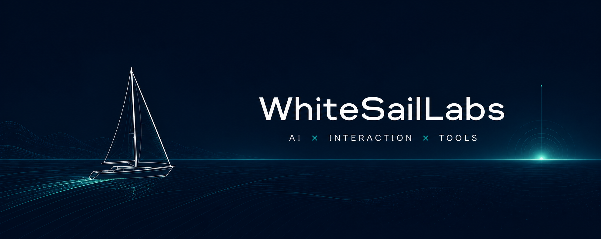

  

<h1 align="center">Hi, I'm LiFan Chen</h1>

  <strong>AI product builder creating local-first agents, intelligent interfaces, and tools that make machines feel less awkward to work with.</strong>

  Shanghai, China · ShanghaiTech University

## Featured work

| Project | What it explores | Stack |
| --- | --- | --- |
| [llm-obsidian-agent](https://github.com/WhiteSailLabs/llm-obsidian-agent) | A local LLM workspace that turns useful Q&A into organized Obsidian notes. | Python · Local LLMs · Obsidian |
| [shengbei-wish](https://github.com/WhiteSailLabs/shengbei-wish) | A gesture-driven, browser-native ritual interface with interactive 3D. | TypeScript · React · Three.js |
| [daily-tech-research](https://github.com/WhiteSailLabs/daily-tech-research) | Daily research notes on emerging technologies and practical AI systems. | Research · AI · Automation |
| [awesome-ai-agent-interview](https://github.com/WhiteSailLabs/awesome-ai-agent-interview) | A growing knowledge base for understanding and interviewing for AI agent work. | Agents · LLMs · Systems |

## Currently building

- An AI-native poker coach that helps players reason about the table.
- A local-first desktop inbox for quickly capturing and organizing thoughts.
- Personalized learning experiences built on agentic tutoring systems.

## Toolkit

`Python` · `TypeScript` · `React` · `Three.js` · `PyTorch` · `Computer Vision` · `AI Agents` · `Local-first Software`

## Principles

> Ship small. Learn fast. Leave readable code.

I care about calm interfaces, useful intelligence, local ownership, and software
that feels thoughtfully made. My current interests include AI devtools, LLM
evaluation, browser automation, computer vision, and new forms of human-computer
interaction.

  Exploring the space where AI, interaction, and perception meet.

