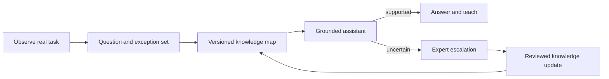

# Knowledge Relay

[简体中文](knowledge-relay.zh-CN.md)

  

AI-generated concept illustration, not a real client site.

> **Portfolio build · Discovery design complete.** The demonstration will use open manuals and synthetic expert exceptions. It does not claim access to a factory or a deployed training program.

## The situation

New operators can read the standard procedure, yet still struggle when symptoms are incomplete, machines behave differently, or an exception is missing from the manual. The same senior expert gets interrupted repeatedly, while managers cannot see which knowledge gaps are actually slowing the team down.

## Pain analysis

- **Documents describe the standard path; experts carry the exception path.** Ordinary RAG retrieves text but misses decision context.
- **Interview-only discovery produces polished summaries, not operational knowledge.** The important details appear while someone performs the task.
- **Training completion is mistaken for capability.** Reading a manual does not prove that a person can diagnose a failure.
- **Unsupported answers create safety risk.** A confident answer without evidence is worse than an escalation.
- **Knowledge decays silently.** Procedures change, but old chunks remain retrievable without an owner or review date.

## My approach

1. Observe a task flow and record recurring questions, decisions, exceptions, and escalation moments.
2. Convert those observations into an evaluation set before building retrieval.
3. Parse manuals and expert notes into versioned knowledge units with owner, source, and review date.
4. Answer routine questions with citations; abstain and escalate when evidence is missing or conflicting.
5. Turn repeated questions into short scenario-based lessons and track demonstrated capability.
6. Feed accepted escalations back into the knowledge map as reviewed updates.

## Agent / human boundary

The agent retrieves, explains, quizzes, records uncertainty, and suggests missing knowledge. A qualified human owns safety-critical judgment, exception approval, and publication of knowledge updates. Unsupported questions must trigger abstention rather than improvisation.

## What I will measure

- Coverage of the observed question and exception set
- Recall@k and citation correctness
- Grounded-answer and abstention quality
- Scenario-task completion, not just quiz completion
- Time to a supported answer
- Expert interruptions avoided, once a baseline exists

## What has been built / what remains

- **Designed:** discovery template, knowledge-unit schema, escalation states, and evaluation plan
- **Next:** open-manual corpus, synthetic exception set, local retrieval service, and training view
- **Not yet claimed:** operator productivity, production accuracy, or deployed safety improvement

## Experience captured

1. The discovery questions are the first evaluation dataset; they should not be discarded after interviews.
2. Tacit knowledge is best captured around decisions and exceptions, not as long narrative transcripts.
3. Abstention and escalation are product features, especially when advice can affect safety or uptime.
4. Knowledge freshness needs an owner and review date; retrieval relevance alone cannot guarantee correctness.

## Project ownership

This is my public Build Lab project. I define the scope, construct the dataset, implement the system, run the evaluation, and publish the limitations and conclusions.
