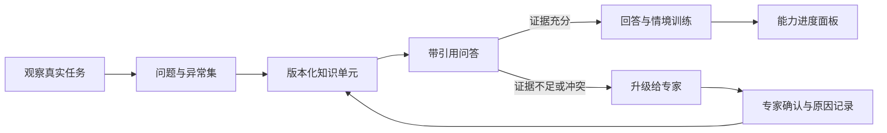

# Knowledge Relay｜把老师傅的经验留在组织里

  

AI 生成的概念插画，用于解释项目场景，并非真实客户现场。

> **个人 FDE Build Lab · 调研与方案阶段。** 本项目受《FDE案例100》案例 1 启发，使用公开设备手册、合成异常记录和可复现实验构建。我没有服务过原案例中的企业，也不会把案例集里的结果写成自己的业绩。

[English version](knowledge-relay.md)

## 故事从一句模糊需求开始

一家精密零部件工厂说：“我们想把老师傅的经验沉淀下来。”

这句话听起来像一个知识库需求，但它还不是一个可以交付的项目。真正的问题藏在新人每天的停顿里：某个参数为什么要在阴雨天调整；同一种材料换了供应批次后，声音为什么不一样；手册要求停机检查，但老师傅为什么先看刀具磨损。标准文档记录的是“正常怎么做”，老师傅掌握的却是“什么时候不能机械地照做”。

案例集中的原型是一家位于斯图加特、约 70–80 人的制造企业。新人培养往往需要两三个月，老师傅既承担生产任务，又要重复回答问题，而且一部分人接近退休。原项目并不是简单做一个 RAG：调研、开发、上线与陪跑跨度约半年，其中上线后的陪跑接近两个月。

我把这个模式转化为一个个人可完成的公开项目：选择一类有公开手册的工业设备，构造“标准操作 + 现场异常 + 专家判断”三层知识，证明知识如何从个人经验进入可验证的训练流程。

## 真正的痛点不是“文档搜不到”

| 表面现象 | 根因 | 如果只做聊天机器人会怎样 |
| --- | --- | --- |
| 新人反复问相同问题 | 标准流程与异常经验分离 | 能回答定义，不能支持现场判断 |
| 老师傅带教时间不足 | 专家时间被低价值重复问答占满 | 新入口反而增加维护负担 |
| 培训结束但能力不可见 | 企业记录了“学过”，没有记录“会不会做” | 只有对话次数，没有能力证据 |
| 旧经验继续被使用 | 知识缺少负责人、版本和复核日期 | 检索相关，但答案已经过时 |
| AI偶尔给出自信答案 | 缺乏拒答和升级机制 | 在安全场景中放大风险 |

## 我会怎样进入现场

第一周不写代码。我会跟着一个“新人任务日”走完整流程：他在哪里停下来、翻过哪些手册、问了谁、问题是否重复、最后是谁承担判断责任。访谈仍然要做，但观察优先，因为很多隐性动作连操作者自己都不会主动说出来。

调研输出不是一份汇报，而是三张可执行的表：

1. **任务地图**：从接单、准备、操作、检查到异常升级的完整路径。
2. **问题与异常集**：高频问题、易错问题、只在特殊条件下出现的问题。
3. **知识责任表**：每条知识来自哪里、谁能批准、多久复核一次。

这里最关键的 FDE 动作，是把调研问题直接变成后面的评估集。原案例中，团队以约 95% 的文档解析覆盖和 80% 以上的召回准确率作为小范围验证参考；我的项目会重新建立自己的基线，不照搬这些数字。

## 最小可用闭环

第一版只覆盖一个设备、一类岗位和 30–50 个真实问题。知识单元不是随意切块，而是包含：适用条件、操作步骤、异常信号、禁止事项、来源、负责人、版本和复核日期。

用户看到的也不是一个孤立聊天框：新人从原培训入口进入情境题，回答后必须指出依据；带教师傅看到的是知识缺口和升级记录；管理员看到的是哪些内容最常失败、哪些答案即将过期。

## 一次具体任务会怎样发生

新人输入：“同一参数下，工件表面突然出现规律性纹路，要不要继续加工？”

系统不会直接生成一段建议，而会依次做四件事：

1. 判断问题属于哪台设备、哪种材料和哪道工序；上下文不足时先追问。
2. 检索标准手册、历史异常卡和已确认的专家记录，分别展示来源。
3. 如果证据一致，给出检查顺序，并明确哪些动作仍需要授权。
4. 如果历史记录冲突或涉及安全阈值，停止建议，生成一张升级卡给带教师傅。

专家的处理结果不会只停留在聊天里，而会形成新的候选知识单元。经过审核后，它进入回归测试：以后相似问题必须能够找到这条经验，也必须在不适用的条件下拒绝套用。

## 人与 Agent 的边界

- Agent 负责检索、引用、追问、情境训练、暴露知识缺口和整理升级上下文。
- 带教师傅负责异常判断、关键参数批准和隐性经验确认。
- 工艺或安全负责人负责知识发布、版本更新与失效处理。
- 任何缺少来源、条件不完整或存在冲突的问题，都必须拒答或升级。

## 我会如何证明它真的有用

项目不会以“回答看起来不错”验收，而会同时建立离线与流程指标：

- 问题集覆盖率、Recall@k、引用正确率和有依据回答率
- 对未知问题和冲突知识的拒答质量
- 情境任务完成率，而不是课程打开次数
- 从提问到得到可执行、带依据答案的时间
- 老师傅被重复打断的次数变化
- 知识过期、无人负责和长期未解决升级的数量

## 失败路径也要成为作品的一部分

我预期第一版最容易失败在三个地方：切块破坏了条件语境；新人描述过于口语导致检索偏移；老师傅没有时间审核新增知识。对应策略分别是结构化知识单元、先追问再检索，以及把审核压缩成可在数分钟内完成的差异确认，而不是要求专家重新写文档。

## 当前状态与交付物

- **已完成**：业务问题拆解、角色边界、知识单元结构和评估方案
- **正在做**：公开手册语料、合成异常记录和任务评估集
- **下一步**：本地检索服务、升级队列、情境训练页和知识健康面板
- **不会宣称**：真实工厂部署、生产效率提升或安全结果改善

最终交付应包含可运行应用、版本化知识地图、评估集与测试器、失败日志和部署手册。更重要的交付，是一套“如何发现、审核、发布和淘汰知识”的组织机制。

## 我沉淀下来的 FDE 判断

1. “沉淀经验”不是需求；“让哪个人在什么时刻少问哪类问题”才是可交付问题。
2. 调研里发现的问题必须进入评估集，否则前期业务工作与后期技术验收会断开。
3. AI 进入原培训流程比新增一个工具重要，真正的落地发生在上线之后。
4. 拒答、升级和知识过期管理不是补充功能，而是可信系统的主干。
5. 最好的结果不是替代老师傅，而是把他的时间从重复回答转移到复杂判断和知识治理。

## 来源与原创边界

故事原型来自 [《FDE案例100》案例 1：从师徒带教到 AI 辅助培训](https://assets.datawhale.cn/Datawhale%20FDE%E6%A1%88%E4%BE%8B100.pdf)。本文中的个人项目范围、公开数据方案、产品结构与评估设计由我重新构建。
