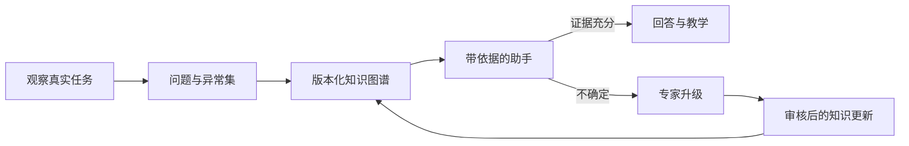

# Knowledge Relay｜知识传承 Agent

> **个人作品集 · 调研设计已完成。** 演示使用公开手册和合成专家异常，不宣称进入过真实工厂或培训项目。

## 真实场景

新人能读懂标准流程，却很难处理信息不完整、设备差异和手册之外的异常。同一位资深专家被反复打断，管理者也看不到真正阻碍团队的知识缺口。

## 痛点分析

- 手册记录标准路径，专家掌握异常路径，普通 RAG 缺少决策语境。
- 只做访谈容易得到漂亮总结，而不是可执行知识；关键细节往往出现在实际操作中。
- “完成培训”不等于具备诊断和处理能力。
- 没有依据的自信回答会放大安全风险。
- 流程已经更新时，旧知识仍可能被检索出来，缺少负责人和复核日期。

## 我的做法

1. 观察完整任务流，记录问题、决策、异常和升级时刻。
2. 在构建检索前，把这些问题直接转化为评估集。
3. 将手册和专家备注拆成带来源、版本、负责人和复核日期的知识单元。
4. 常规问题必须带引用回答；证据缺失或冲突时主动拒答并升级。
5. 把高频问题转为情境式短课，用任务表现而不是阅读次数衡量掌握度。
6. 将已确认的升级案例回写到知识图谱。

## 人与 Agent 的边界

Agent 负责检索、解释、提问、记录不确定性和发现知识缺口；专业人员负责安全关键判断、异常批准和知识发布。无法支持的问题必须拒答，不能临场编造。

## 验证方式

问题与异常覆盖率、Recall@k、引用正确率、有依据回答率、拒答质量、情境任务完成率，以及建立基线后的专家打断次数。

## 当前进度

- 已设计：调研模板、知识单元结构、升级状态和评估方案
- 下一步：公开手册语料、合成异常集、本地检索服务和训练视图
- 尚未宣称：真实操作员效率、生产准确率或安全改进

## 经验沉淀

1. 调研问题本身就是第一版评估数据，不应在访谈结束后被丢弃。
2. 隐性知识应围绕决策和异常采集，而不是堆积长篇访谈文本。
3. 在安全和稳定性场景中，拒答和升级是核心产品能力。
4. 知识新鲜度需要负责人和复核日期，检索相关并不代表内容正确。

[English version](knowledge-relay.md)
