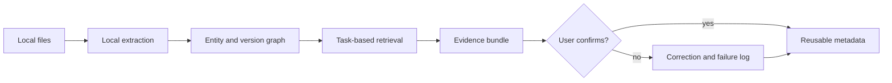

# Local Asset Navigator

[简体中文](local-asset-navigator.zh-CN.md)

  

AI-generated concept illustration, not a real client site.

> **Portfolio build · In progress.** Built on public/synthetic data and an opt-in local workspace. This page separates implemented work from hypotheses; it does not claim a client deployment.

## The situation

Small teams often have the files they need—product photos, quotations, customer notes, templates, and delivery records—but not the relationships between them. A request such as “find the latest approved artwork and everything used for its last delivery” becomes a manual search across folders, chat history, and individual memory.

## Pain analysis

The visible problem is slow search. The deeper problems are:

- **Folder paths are not business context.** A filename rarely says which customer, product, order, or approval it belongs to.
- **The newest file is not always the canonical file.** Copies and exported versions create dangerous false confidence.
- **Useful corrections disappear in chat.** The user tells an assistant which file is right, but that knowledge is not saved as durable metadata.
- **Cloud-first tools can violate the actual constraint.** Customer material and internal assets may not be allowed to leave the laptop.
- **A plausible wrong result is worse than no result.** Search must expose provenance and uncertainty, not just semantic similarity.

## My approach

I am extending [llm-obsidian-agent](https://github.com/WhiteSailLabs/llm-obsidian-agent) into a local-first asset workspace.

1. Start with 12–20 real search tasks, not a generic “chat with files” demo.
2. Inventory file types, naming patterns, permissions, and known version traps.
3. Extract text, image descriptions, timestamps, and explicit entity links locally.
4. Build a lightweight graph across customer, product, project, version, and delivery.
5. Return an asset bundle with source paths, relationship reasons, confidence, and stale-version warnings.
6. Turn user corrections into versioned metadata that affects future retrieval.

## Agent / human boundary

The system may propose relationships and rank files. The user owns canonical-version decisions, sensitive links, and permission changes. Data stays local by default; any external model call must be explicit, scoped, and inspectable.

## What I will measure

- Top-5 success on a fixed task-based evaluation set
- Median time to assemble a complete asset bundle
- Canonical-version error rate
- Provenance coverage for every returned item
- Permission-boundary tests
- Percentage of corrections reused successfully on later tasks

No improvement number will be published until the baseline and evaluation set are reproducible.

## What has been built / what remains

- **Existing foundation:** local LLM workspace and Obsidian-oriented knowledge capture
- **In progress:** corpus generator, file inventory, entity schema, and retrieval task set
- **Next:** multimodal index, relationship browser, correction loop, and evaluation runner
- **Not yet claimed:** production deployment, customer adoption, or measured time savings

## Experience captured

1. Retrieval quality is limited more by relationship modeling and version semantics than by the embedding model.
2. “Local-first” is an architecture decision: extraction, indexing, logs, and backups all need the same privacy boundary.
3. The evaluation unit should be a complete business task, not a single relevant chunk.
4. Corrections become valuable only when they change durable state and can be tested later.

## Project ownership

This is my public Build Lab project. I define the scope, construct the dataset, implement the system, run the evaluation, and publish the limitations and conclusions.
