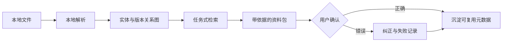

# Local Asset Navigator｜本地资产导航 Agent

> **个人作品集 · 构建中。** 使用公开/合成数据和用户主动选择的本地资料，不宣称真实客户部署。

## 真实场景

小团队通常不缺文件，而是缺少文件之间的业务关系。产品图片、报价单、客户备注、模板和交付记录散落在不同目录中。“找到某款产品最后批准的设计稿和对应交付文件”往往要依赖个人记忆。

## 痛点分析

- 文件路径不等于客户、产品、订单和审批关系。
- 最新修改的文件不一定是正式版本，重复副本会制造错误信心。
- 用户在对话中纠正过的关系没有成为可复用知识。
- 客户资料可能不能离开本机，云端优先方案不符合真实约束。
- 没有来源和不确定性的“相似答案”，比找不到更危险。

## 我的做法

1. 先定义 12–20 个真实查找任务，而不是直接做“与文件聊天”。
2. 盘点文件类型、命名规律、权限边界和常见版本陷阱。
3. 在本地提取文字、图片描述、时间和实体关系。
4. 建立客户、产品、项目、版本、交付之间的轻量关系图。
5. 返回带路径、关系依据、置信度和过期版本提示的资料包。
6. 把用户纠正保存为版本化元数据，并纳入后续评估。

## 人与 Agent 的边界

Agent 负责提出关系、排序文件和解释依据；用户决定正式版本、敏感关系和权限变化。默认所有数据留在本地，任何外部模型调用都必须显式、可控、可检查。

## 验证方式

Top-5 任务成功率、完整资料包组装时间、正式版本错误率、来源覆盖率、权限边界测试，以及纠正信息在后续任务中的复用率。没有可复现基线前，不发布效率提升数字。

## 当前进度

- 已有基础：本地 LLM 工作区和 Obsidian 知识沉淀能力
- 构建中：合成资料库、文件盘点、实体结构和检索任务集
- 下一步：多模态索引、关系浏览器、纠正闭环和评估器
- 尚未宣称：生产部署、客户采用或真实节省时长

## 经验沉淀

1. 检索上限更多取决于关系和版本语义，而不只是 Embedding 模型。
2. 本地优先是完整架构边界，解析、索引、日志和备份都必须遵守。
3. 评估单位应该是完整业务任务，而不是单个相关文本块。
4. 纠正只有进入持久状态并能被回归测试时，才真正产生价值。

[English version](local-asset-navigator.md)
