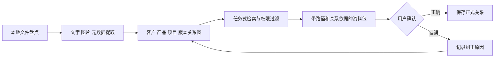

# Local Asset Navigator｜让散落文件变成企业可用资产

  

AI 生成的概念插画，用于解释项目场景，并非真实客户现场。

> **个人 FDE Build Lab · 构建中。** 本项目受《FDE案例100》案例 11 启发，以合成外贸资料库和用户主动选择的本地笔记实现，不接触原企业数据，也不把原案例成果包装成自己的客户经历。

[English version](local-asset-navigator.md)

## 老板最初只想找回一个文件

设想一家十几人的外贸礼品公司，业务跑了很多年，电脑里积累了样图、美工图、报价单、客户交付图、产品模板和物流文件。文件并没有丢，但它们分散在不同电脑、文件夹和命名习惯中。

老板提出的需求很小：“以后我能不能只说一句，帮我找出某个客户以前用过的模板？”

原案例里的企业年销售额已有数亿元，却仍被这种基础问题困住。一次客户发来带不规则刻度的三角尺产品，美工和 3D 打样都没有弄清刻度含义。FDE 没有先开发软件，而是现场让 AI 识别图片、追查产品与厂商资料，约 10 分钟确认所谓不规则刻度表示角度。原本可能研究一两天的问题，在老板眼前被重新定义了。

这个瞬间比做一场 AI 培训更重要：客户第一次看到，AI 不是又一个要学习的软件，而是一种新的解决问题方式。

## 小需求下面藏着四个系统问题

1. **资产没有关系。** 文件存在，但客户、产品、订单、版本和交付之间的连接只在人脑里。
2. **正式版本不清楚。** “final”“最终版2”和导出副本同时存在，最新时间并不代表已批准。
3. **环境不具备可运行性。** 网络、电脑、权限和目录结构不一致，再强的 Agent 也会在第一天报错。
4. **信任不足。** 最有价值的客户资料、合同和设计文件，恰好是老板最不愿交给外部团队的数据。

原案例里，FDE 到现场后的第一天几乎是在做网络工程师：4 台路由器、2 台光猫、1 台交换机和软路由长期叠加，内网不稳定。这个细节提醒我，所谓“AI 落地”经常从修网络、统一环境和梳理权限开始，而不是从模型开始。

## 我的个人实现：先造一个可信的小公司资料世界

我会生成一个可公开复现的外贸业务资料库：5 个客户、20 个产品、3 年版本记录，包含图片、PDF、报价表、邮件摘要、包装模板和交付清单。数据中会主动制造现实问题：重复命名、跨目录引用、过期模板、缺少客户编号和错误版本。

第一批评估任务不问“这份文档讲了什么”，而是更接近业务动作：

- 找出客户 A 上次批准的产品包装模板，并附上对应交付照片。
- 对比某产品的两个报价版本，说明价格变化来自哪里。
- 找到某次投诉对应的产品批次、原设计和整改后的文件。
- 返回最新可用素材，但排除未批准草稿和无权限文件。

## 从散乱文件到可追溯资料包

系统返回的不只是文件列表，而是一份“为什么是它”的答案：源路径、客户关系、版本链、批准状态、最后使用场景，以及任何不确定性。图片检索也不能只靠视觉相似度；同一产品不同客户的 Logo、颜色和包装规范可能不同，必须结合业务关系。

## 数据不能带走，就把开发能力送进去

原案例中，客户不愿把核心文件交给外部团队。项目因此调整为：先把 Harness、原则、任务规范和 Demo 部署到客户自己的 Codex，再让客户侧 AI 在本地文件环境中继续开发；测试日志由本地 AI 整理后反馈，数据本身不离开企业。

我的实现会复刻这个思路：

- 默认在本机完成解析、索引、检索和日志记录。
- 外部模型调用按任务显式开启，并只发送必要的最小片段。
- 权限检查发生在检索前，而不是答案生成后。
- 关系纠正以版本化元数据保存，可导出、备份和回滚。
- 整套数据和索引不绑定某一家模型供应商。

## 一次任务如何发生

用户输入：“把 Northwind 去年那款开瓶器最终包装稿和交付照片找出来。”

系统先解析客户、时间、产品和“最终”四个约束，随后检索候选文件并重建版本链。如果两份文件都标记为 final，它不会猜，而会用审批记录、后续交付引用和文件关系解释哪一份更可能是正式版本；证据不足时要求用户确认。用户的选择会写回关系图，并在以后相似任务中作为可测试规则复用。

## 人与 Agent 的边界

- Agent 负责提取、建立候选关系、排序、解释依据和发现冲突。
- 用户负责确认正式版本、敏感关系和客户权限。
- 系统不能因为语义相似而跨越权限边界，也不能把“最新修改”默认当成“正式批准”。
- 外部服务是否可用，必须是可见的任务级选择。

## 如何验证价值，而不是只展示搜索框

我会先人工完成同一组任务，记录找到完整资料包的时间和错误，再与系统对比：

- Top-5 是否包含正确文件不够，还要检查资料包是否完整。
- 正式版本错误率必须单独统计，因为它的业务风险最高。
- 每个结果是否都有可读来源与关系依据。
- 无权限、已删除和冲突版本能否正确拦截。
- 用户纠正能否在后续任务中稳定复用。

在真实基线建立前，不写“效率提升 80%”之类的数字。原案例本身也明确处于第一阶段，没有急于给出整体效率百分比；可信度来自诚实描述阶段，而不是补造一个结果。

## 最容易失败的地方

第一，扫描全部文件会制造大量低质量元数据；所以先覆盖高价值目录和任务。第二，图片描述模型容易忽略客户特有细节；所以视觉特征必须与项目关系结合。第三，老板或员工没有时间持续测试；所以系统要自动保留失败上下文，把反馈压缩成“确认 / 纠正 / 暂不处理”三个低成本动作。

## 当前状态与交付物

- **已有基础**：[llm-obsidian-agent](https://github.com/WhiteSailLabs/llm-obsidian-agent) 的本地知识工作区
- **正在做**：合成资料库、文件盘点器、实体结构和任务评估集
- **下一步**：多模态索引、关系浏览器、版本冲突界面和纠正闭环
- **不会宣称**：真实客户采用、生产环境稳定性或已经节省的工时

最终交付包括本地索引器、关系浏览器、权限与来源模型、评估任务、备份迁移手册，以及企业可以继续添加新任务的 Skill 模板。

## 我沉淀下来的 FDE 判断

1. 第一个胜仗应该是老板正在付出时间、且能当场判断对错的小问题。
2. 文件搜索真正困难的是业务关系、版本语义和权限，不是向量数据库选型。
3. 当数据不能离开现场时，架构应该移动能力，而不是移动数据。
4. 很多决定成败的工作并不“AI”：网络、Windows 环境、命名、权限和测试节奏同样属于交付。
5. 最理想的结果不是企业永远依赖 FDE，而是下一次出现问题时能够先靠自己的数据、工作流和 Agent 解决。

## 来源与原创边界

故事原型来自 [《FDE案例100》案例 11：从文件散乱到随取随用](https://assets.datawhale.cn/Datawhale%20FDE%E6%A1%88%E4%BE%8B100.pdf)。本文中的合成企业、评估任务、产品结构与工程计划由我重新构建。
