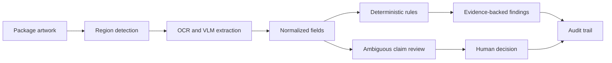

# Packaging Preflight

[简体中文](packaging-preflight.zh-CN.md)

  

AI-generated concept illustration, not a real client site.

> **Portfolio build · Technical design complete.** The demonstrator will use synthetic food-package artwork and public rules. It is not legal advice, a compliance certification, or a claim of client delivery.

## The situation

Packaging review sits between design, product, legal, procurement, and channel operations. A small error discovered after artwork approval can trigger another design round, supplier delay, or launch slip. Reviewers spend time rechecking deterministic details while genuinely ambiguous claims still require expert judgment.

## Pain analysis

- **One image contains several different problem types.** Nutrition calculations, text extraction, required marks, marketing claims, and visual hierarchy need different methods.
- **A vision model can read a value without proving where it came from.** Reviewers need coordinates, confidence, and the original crop.
- **Rules change by product and channel.** A hard-coded “compliant / non-compliant” answer hides scope and version risk.
- **False negatives are more expensive than noisy suggestions.** The system must be evaluated on seeded violations, not attractive demos.
- **Legal interpretation cannot be delegated to a model.** Deterministic checks and human judgment must remain visibly separate.

## My approach

1. Create synthetic package designs with controlled violations and clean ground truth.
2. Segment each artwork into identity, ingredients, nutrition table, claims, marks, and layout regions.
3. Extract fields with OCR/VLM while retaining region coordinates and confidence.
4. Run reproducible calculations and explicit rules in code.
5. Attach the exact rule source, applicability, version, and evidence crop to every finding.
6. Send ambiguous claims and visual judgments to a human reviewer.
7. Store accepted and rejected findings as regression tests.

## Agent / human boundary

Code owns reproducible calculations and deterministic checks. Models locate, extract, normalize, and explain; they do not invent rules. A qualified reviewer owns applicability, legal interpretation, subjective layout judgment, and final approval.

## What I will measure

- OCR accuracy by region and field type
- Deterministic-rule coverage
- Recall on deliberately seeded violations
- False-negative rate by severity
- Rule citation and evidence-crop completeness
- Reviewer time per package and correction turnaround

## What has been built / what remains

- **Designed:** region taxonomy, rule/evidence schema, reviewer boundary, and evaluation plan
- **Next:** synthetic artwork set, extraction pipeline, rule engine, and review interface
- **Not yet claimed:** legal compliance, production recall, or launch-time savings

## Experience captured

1. Multimodal workflows improve when the document is decomposed into regions before model reasoning.
2. Every finding needs two forms of provenance: where it appeared in the artwork and which rule produced the judgment.
3. Deterministic rules should be executable tests, not prose hidden inside a prompt.
4. Human feedback matters only when accepted/rejected findings become regression cases.

## Source pattern

Adapted from the packaging-review and product-lifecycle pattern in Case 19 of [Datawhale FDE案例100](https://assets.datawhale.cn/Datawhale%20FDE%E6%A1%88%E4%BE%8B100.pdf). The implementation, dataset, and conclusions are my own.
