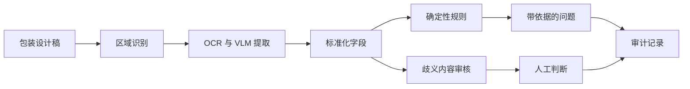

# Packaging Preflight｜包装预检 Agent

> **个人作品集 · 技术设计已完成。** 演示使用合成食品包装和公开规则，不构成法律建议、合规认证或客户交付声明。

## 真实场景

包装审核横跨设计、产品、法务、采购和渠道运营。设计定稿后才发现一个基础错误，可能触发重新设计、供应商延期甚至上市延误。审核人员反复检查确定性细节，而真正有歧义的宣传表述仍需要专家判断。

## 痛点分析

- 一张包装图里混合了营养计算、文字提取、必备标识、宣传语和视觉层级等不同问题。
- 视觉模型能读出数值，却不一定能证明数值来自哪个区域。
- 规则会随产品和渠道变化，简单的“合规/不合规”隐藏了适用范围和版本风险。
- 漏检成本高于普通误报，必须用主动植入的问题评估，而不是只展示漂亮样例。
- 法律解释不能交给模型，确定性检查和人工判断必须清晰分离。

## 我的做法

1. 创建带标准答案的合成包装，并植入不同严重程度的问题。
2. 将画面拆分为身份信息、配料、营养表、宣传语、标识和版式区域。
3. 使用 OCR/VLM 提取，同时保存坐标、原图裁剪和字段置信度。
4. 用代码执行可复现计算和显式规则。
5. 每项发现绑定规则来源、适用范围、版本和证据图块。
6. 歧义宣传语和视觉判断进入人工审核。
7. 将接受/驳回结果沉淀为回归测试。

## 人与 Agent 的边界

代码负责可复现计算和确定性规则；模型负责定位、提取、标准化和解释，但不能发明规则。专业审核人员负责规则适用性、法律解释、主观版式判断和最终批准。

## 验证方式

分区域 OCR 准确率、规则覆盖率、植入问题召回率、按严重程度统计的漏检率、规则引用与证据图块完整度，以及单包装审核时间。

## 当前进度

- 已设计：区域分类、规则/证据结构、人工边界和评估方案
- 下一步：合成包装集、提取流水线、规则引擎和审核界面
- 尚未宣称：法律合规、生产召回率或上市周期缩短

## 经验沉淀

1. 多模态工作流应先拆分文档区域，再进行模型推理。
2. 每个结论都需要双重来源：它在设计稿中的位置，以及产生判断的规则。
3. 确定性规则应该是可执行测试，而不是藏在 Prompt 里的文字。
4. 人工反馈只有变成回归样例时，才会持续改进系统。

[English version](packaging-preflight.md)
