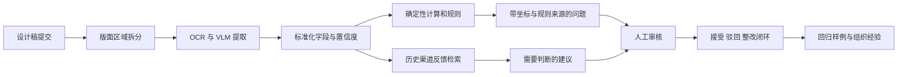

# Packaging Preflight｜把包装审核从排队变成前置

  

AI 生成的概念插画，用于解释项目场景，并非真实客户现场。

> **个人 FDE Build Lab · 技术设计完成。** 本项目受《FDE案例100》案例 19 启发，使用合成食品包装和公开规则实现。它不构成法律建议或合规认证，也不宣称原案例中的客户与组织成果属于我。

[English version](packaging-preflight.md)

## 审核为什么总在最后排队

一家消费品企业一年可能开发 100 多个 SKU。一个产品从需求、口味、配方到包装、合规、中试和渠道上线，会经过产品、研发、设计、法务、采购和渠道多个角色。系统往往记录了最后结果，却没有留下“为什么这样做”的上下文。

包装是这条长链中最容易看见冲突的节点。设计师检查错别字和版式，法规人员检查食品法、广告法和营养标识，渠道检查自己的 Logo 和上架规范，产品经理判断包装是否准确表达产品。SKU 增加后，所有问题一起堆到审核人面前，于是基础错误、复杂判断和渠道经验在同一队列里排队。

原案例的关键问题不是“能不能让 AI 看图”，而是重新划分工作：哪些确定性问题应该自动拦截，哪些历史反馈应该沉淀，哪些判断必须留给人。

## 问题不是一张图，而是四种工作

| 审核层 | 典型问题 | 更适合的处理方式 |
| --- | --- | --- |
| 基础质量 | 错别字、漏字段、数字矛盾 | OCR + 确定性规则 |
| 计算与硬规则 | 营养表、NRV、净含量格式 | 可执行代码 + 版本化规则 |
| 渠道经验 | 标识位置、尺寸关系、历史驳回原因 | 历史反馈检索 + 人工确认 |
| 产品表达 | 是否准确、有吸引力地表达产品 | 产品经理和设计师判断 |

如果把四种工作都交给一个 VLM，它可能给出流畅但不可复现的答案；如果全部留给人，专家时间仍被低级错误占满。

## 原案例里的第一个关键转折：先观察，不急着解决

团队最初发现，外部 FDE 一直参加会议、待在业务群里，会让员工产生压力。后来他们把 Agent 放进业务群，两三周内只收集上下文，不急着输出方案。Agent 结合真实沟通定位到包装审核这个高频问题。

这让我把“发现问题”也当成系统能力：观察必须有边界、时间窗口和明确目的，不能演变为无限采集。我的公开项目会用合成会议记录、驳回说明和设计任务模拟这一阶段，再让系统判断哪些问题高频、可衡量、值得进入候选清单。

## 第二个转折：让业务人员给 Agent 写岗位说明书

确定包装审核值得做之后，原团队没有直接写 Skill。他们借用 HRBP 方法，找真正审核的人拆解岗位：输入是什么、输出是什么、哪些规则直接执行、哪些情况需要判断、需要哪些上下文。

我的版本会产出一份机器可执行的岗位说明书：

- 接收：包装正反面设计稿、产品基础信息、目标渠道和规则版本
- 输出：问题等级、证据区域、命中规则、建议动作与升级对象
- 自动处理：字段完整性、确定性计算、明确禁用项
- 必须升级：规则适用性不明、营销表述歧义、审美与产品表达
- 禁止行为：编造法规、隐去置信度、把建议写成最终批准

## 我的个人实现：用“故意犯错”的包装验证系统

我会设计一组不对应真实品牌的合成食品包装，分别植入：NRV 计算错误、净含量格式问题、前后信息矛盾、遗漏字段、模糊艺术字、渠道标识冲突和需要专业判断的宣传语。每个问题都有区域坐标、严重程度、适用规则和预期处理方式。

这套数据能回答真正重要的问题：系统漏掉了多少问题？误报集中在哪里？确定性规则是否稳定？面对不适用或冲突规则时能否升级？

## 从一张图到带证据的审核闭环

包装图先被拆成身份信息、配料、营养表、宣传语、标识和视觉区域。不同区域使用适合的 OCR/VLM；蛋白质、每份含量和 NRV 等计算由代码复现。每项发现同时保存两类来源：它位于设计稿哪里，以及是哪条规则产生了判断。

系统输出不是一句“可能不合规”，而是一张可操作问题卡：原图裁剪、提取值、计算过程、规则版本、适用范围、置信度和建议负责人。审核人能够清楚知道该信什么、该查什么。

## 不停在单次看图，而是进入产品生命周期

预检发生在设计稿交给采购和生产之前。设计一提交，系统先拦截基础错误；产品经理与法规人员只处理复杂判断。最终上线、被渠道接受或遭驳回的包装，会成为高质量样本。

下一次出现相似设计，系统不仅检查硬规则，还可以提醒：“该渠道过去三次驳回过类似标识位置。”这时价值开始从一次审核提效，转向把个人经验变成组织经验。

## 人与 Agent 的边界

- 代码负责营养计算、字段一致性和可执行硬规则。
- OCR/VLM 负责定位、提取、标准化和解释建议。
- 法规人员负责规则适用性与法律判断。
- 产品经理和设计师负责产品表达与审美决策。
- 系统只能做预检和证据组织，不能签发合规结论。

## 如何验证，不被漂亮 Demo 欺骗

- 分区域、分字段统计 OCR 准确率，而不是一个整图分数
- 在植入问题上测召回率和按严重程度统计的漏检率
- 检查每个结论是否同时具备图像位置和规则来源
- 记录人工接受、驳回和修改系统建议的原因
- 比较单个包装的基础检查时间与专家判断时间
- 对规则升级做历史回放，防止新版本破坏旧结果

第一目标不是追求最低误报，而是控制高严重度漏检。系统宁可把歧义交给人，也不能以“AI 已通过”制造虚假安全感。

## 最容易失败的地方

艺术字和密集表格会让通用视觉理解失真；法规文本可能更新且适用范围复杂；历史渠道反馈也可能只是一次特殊情况。解决方式分别是区域级工具组合、规则版本与适用范围管理，以及把经验标记为“候选规则”而不是自动升级为全局标准。

## 当前状态与交付物

- **已完成设计**：区域分类、岗位说明书、规则/证据结构、人工边界与评估方案
- **下一步**：合成包装集、区域提取流水线、规则引擎和审核界面
- **不会宣称**：法律合规、生产漏检率或已经缩短的上市周期

最终交付包括标注数据集、多模态预检流水线、带测试的规则引擎、证据审核界面、审计记录、限制说明和失败目录。

## 我沉淀下来的 FDE 判断

1. 先让业务人员定义岗位，再定义 Agent；外部团队不能替内行凭空写规则。
2. 把工作拆成确定性检查、可沉淀经验和必须由人判断的三层。
3. 多模态系统应先拆区域，再选择工具，不能让一个模型承担所有任务。
4. 每个结论都要有双重来源：原图位置和规则依据。
5. 单点 Skill 只有接入上下游、形成反馈闭环后，才会成为真正的业务系统。

## 来源与原创边界

故事原型来自 [《FDE案例100》案例 19：从人工排队到审核前置](https://assets.datawhale.cn/Datawhale%20FDE%E6%A1%88%E4%BE%8B100.pdf)。本文中的合成包装、岗位说明书、评估数据与产品设计由我重新构建。
