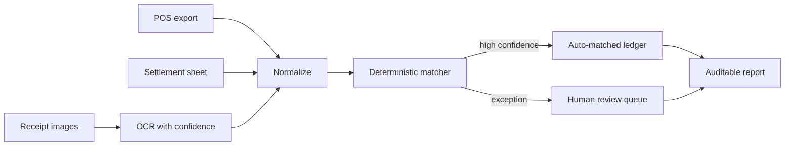

# Reconcile Agent

[简体中文](reconcile-agent.zh-CN.md)

> **Portfolio build · Prototype specified.** The dataset will be generated and all discrepancies will be seeded. This is not presented as work performed for a retailer.

## The situation

A store closes a period with three imperfect views of the same business event: POS exports, mall settlement sheets, and receipt images. Most records agree. A small set does not, and those exceptions consume most of the review time.

## Pain analysis

- **The work is cross-format, not simply spreadsheet matching.** IDs, dates, taxes, discounts, and refunds are represented differently.
- **Manual review gives equal attention to unequal risk.** Staff repeatedly inspect obvious matches instead of focusing on exceptions.
- **OCR uncertainty leaks into financial decisions.** A model-generated field can silently become an accounting fact.
- **Tolerance policies are often tribal knowledge.** The reason two records were accepted is not preserved.
- **A summary total is not an audit trail.** Every conclusion must point back to the exact source rows and image regions.

## My approach

The product is a controlled first-pass reconciliation workflow, not a finance chatbot.

1. Generate POS, settlement, and receipt datasets with known matches and injected discrepancies.
2. Define the matching hierarchy, tolerance policy, and exception owner before writing agent logic.
3. Parse structured data deterministically; use OCR only for fields that exist solely in images.
4. Auto-match only when an explicit rule and confidence threshold both pass.
5. Put unmatched and ambiguous records into a review queue with side-by-side evidence.
6. Export a row-level audit report and a reusable decision log.

## Agent / human boundary

Code owns arithmetic, identifiers, dates, tolerances, and deterministic matching. Models may normalize OCR output or explain an ambiguity, but their output is never accepted as a financial adjustment without evidence. A human approves unresolved differences and policy changes.

## What I will measure

- Auto-match coverage
- False-match rate, targeted at zero on the controlled test set
- Precision and recall for injected discrepancy types
- Review minutes per reconciliation cycle
- Evidence completeness for every decision
- Variance surfaced, reported only on the synthetic benchmark

## What has been built / what remains

- **Specified:** discrepancy taxonomy, matching hierarchy, review states, and evaluation metrics
- **Next:** dataset generator, deterministic engine, receipt OCR adapter, and review UI
- **Not yet claimed:** recovered revenue, production accuracy, or staff-hours saved

## Experience captured

1. The highest-value automation is often exception routing, not full autonomy.
2. LLMs should handle ambiguity around the edges; accounting truth should remain deterministic.
3. Confidence must be attached to individual extracted fields, not one score for the whole document.
4. A useful demo needs deliberately difficult failures: split payments, refunds, duplicate receipts, date rollovers, and tolerance-boundary cases.

## Source pattern

Adapted from the retail reconciliation pattern in Case 10 of [Datawhale FDE案例100](https://assets.datawhale.cn/Datawhale%20FDE%E6%A1%88%E4%BE%8B100.pdf). The implementation, dataset, and conclusions are my own.
