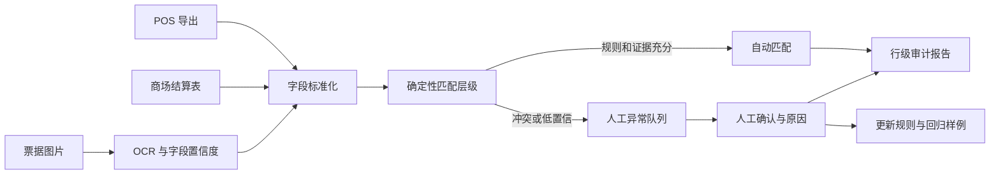

# Reconcile Agent｜让人只处理真正的差异

  

AI 生成的概念插画，用于解释项目场景，并非真实客户现场。

> **我的 FDE Build Lab 项目 · 原型规格完成。** 我使用程序生成的 POS、商场结算和票据数据；从异常设计、匹配引擎到审核界面和评估均由我负责。

[English version](reconcile-agent.md)

## 一个看起来“不值得用 AI”的问题

线下零售门店每个结算周期都要面对三套证据：自己的 POS 数据、商场提供的结算表，以及纸质或扫描票据。店员或店长把数据导出来，看总额、看分项、逐笔核对；发现差异后重新确认、修改，再对一次。

这项工作没有技术光环，却可能花掉一两个人天。更矛盾的是，做对账的往往也是背销售指标的人。每多花一个小时核对，就少一个小时服务顾客和经营门店。

我为项目设定的业务假设是：当核对一笔小差异的人工成本高于差异本身时，团队会自然形成“容忍区间”。系统真正要验证的，不只是能否减少核对时间，而是自动预审能否让过去不值得人工追查的差异重新变得可处理。所有金额与差异比例都由数据生成器控制，不使用或暗示真实客户收益。

这就是故事的转折：一个“省时间”的后台流程，可能直接靠近收入。

## 为什么这个问题适合作为第一单

我把对账排在其他候选项目之前，因为它具备一个小胜仗需要的条件：流程清晰、涉及角色少、价值可计算、反馈周期短、技术成本可控，而且用户不需要先投入大量时间学习。

| 候选方向 | 价值验证周期 | 组织复杂度 | 第一单风险 |
| --- | --- | --- | --- |
| 自动客服 | 商机转化需要长期追踪 | 涉及客服、销售和运营 | 中高 |
| 竞品分析 | 结果要经过后续策略才能体现 | 数据来源与平台限制复杂 | 高 |
| 对账预审 | 工时和差异可以按周期计算 | 店员、财务和异常负责人 | 相对低 |

FDE 的第一步不是找“最酷的 AI 场景”，而是找最快能形成正反馈的业务闭环。

## 我的个人实现：造一套能故意出错的数据

我会生成 3 个月、8 家虚拟门店的数据，每天包含 POS 交易、商场结算行和票据图片。数据生成器会植入现实中常见的异常：

- 金额相同但订单号格式不同
- 跨日结算和时区边界
- 拆单、合单、部分退款和撤销交易
- 重复票据、缺失票据和模糊 OCR
- 税费、折扣和四舍五入容差
- 一对多、多对一以及没有唯一答案的记录

因为所有异常都有标准答案，我可以测量系统究竟发现了什么、错配了什么，而不是拿几个成功截图证明“Agent 会对账”。

## 系统不追求全自动，而是接管第一轮

匹配层级从最可靠的键开始：唯一流水号、明确订单关系、日期与金额组合，再到受控容差。OCR 只负责提取图片里不存在于结构化数据的字段；模型可以解释歧义，却不能替代金额计算和账务规则。

自动匹配必须同时满足三个条件：规则明确、证据完整、置信阈值通过。任何无法解释“为什么匹配”的结果都进入人工队列。

## 店长实际看到的不是 Agent 对话框

一次周期结束后，系统自动运行。店长打开的是一张结果页：

- 312 笔已按明确规则匹配，可以抽样检查；
- 9 笔金额一致但订单号冲突，需要确认来源；
- 4 笔只有票据图片，OCR 中两个字段低置信；
- 3 笔超过容差，其中 1 笔可能是重复结算。

点开一条异常时，左右两侧展示 POS、商场结算和票据裁剪，中间显示匹配规则、字段差异和系统没有自动通过的原因。人工选择“确认匹配”“确认差异”“需要补资料”，并选择业务原因。系统输出的不只是结论，还有完整审计链。

这比让员工学习一个新聊天工具更容易被接受：员工感受到的是“第一轮已经有人做完，我只看真正的差异”。

## Day One 就设计两种规模

我的项目从第一天就同时描述轻量验证和规模化边界，分成两层：

- **个人 MVP**：本地批处理、SQLite、文件导入和单人审核队列，用最低成本验证逻辑。
- **扩展设计**：幂等任务、门店隔离、失败重试、批次版本、可观测性和队列化执行。

轻量验证不等于没有规模化思考，但也不能为了未来规模把第一版做成复杂平台。

## 人与 Agent 的边界

- 确定性代码负责金额、日期、编号、容差和匹配规则。
- OCR/VLM 负责图片字段提取、格式归一和歧义提示。
- 店长或财务人员确认低置信记录、业务例外和任何账务调整。
- 新规则必须经过历史数据回放，不能因为一次人工确认就立即影响全部门店。

## 如何验证价值

技术层面测自动匹配覆盖率、误匹配率、异常精确率/召回率、字段 OCR 准确率和证据完整度。流程层面测每周期人工审核分钟数、每类异常平均处理时间和返工次数。业务层面只报告在合成数据上被发现的差异，不伪造真实“追回收入”。

误匹配率是最重要的护栏。第一版宁可把更多记录送给人，也不应该为了漂亮的自动化比例错误合并账目。

## 最容易踩的坑

1. 只看总额会掩盖相互抵消的少收和多收。
2. 用一个文档级置信度会遮住单个关键字段的不确定性。
3. 前期不问清退款、容差和跨日规则，后期会以返工和 Token 成本偿还。
4. 如果老板、中层和一线的责任边界没有对齐，任何异常都会变成“AI 项目组的问题”。

## 当前状态与交付物

- **已完成规格**：异常分类、匹配层级、审核状态、证据模型和评估指标
- **下一步**：数据生成器、确定性引擎、票据 OCR 适配器和审核界面
- **不会宣称**：真实追回收入、生产准确率或已经节省的人天

最终交付包括可复现数据生成器、匹配引擎、异常审核界面、行级审计报告、失败恢复说明和从本地 MVP 扩展到多门店的架构笔记。

## 我沉淀下来的 FDE 判断

1. 第一单优先选择价值显性、反馈快、角色少、成本可控的任务。
2. 最有价值的自动化经常是把异常留给人，而不是追求 100% 无人化。
3. 确定性事实交给代码，模型处理非结构化输入和边缘歧义。
4. 不要让用户先承担录入和学习成本，再等待未来收益；应让他第一次使用就看到已处理结果。
5. AI 有时最大的价值，是让企业重新做起过去因为成本太高而放弃的事情。

## 项目归属

这是我的公开 Build Lab 项目。我负责虚拟门店数据、异常生成器、匹配规则、审核体验、评估与工程计划；所有业务结果都只基于公开可复现的合成基准。
