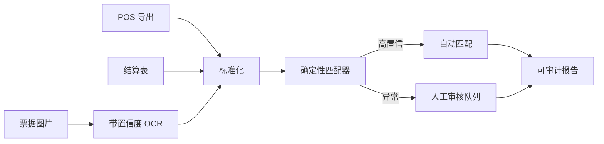

# Reconcile Agent｜智能对账 Agent

> **个人作品集 · 原型规格已完成。** 数据和差异均由程序生成，不宣称曾为零售客户交付。

## 真实场景

门店结算时需要核对 POS 导出、商场结算表和票据图片。大多数记录一致，少数异常却占据了大部分人工审核时间。

## 痛点分析

- 这不是简单的两张表匹配：编号、日期、税费、折扣和退款表达不同。
- 人工审核平均分配注意力，没有优先处理高风险异常。
- OCR 的不确定结果可能悄悄变成财务事实。
- 容差规则经常只存在于个人经验里，缺乏可追溯依据。
- 汇总金额不是审计链路，每个结论都必须能回到源行和图片区域。

## 我的做法

1. 生成带标准答案的 POS、结算单和票据数据，并注入已知异常。
2. 在写 Agent 逻辑前定义匹配层级、容差策略和异常负责人。
3. 结构化数据用确定性代码解析，只有图片字段才使用 OCR。
4. 只有显式规则和置信阈值同时通过时才自动匹配。
5. 异常进入带并排证据的人工审核队列。
6. 输出行级审计报告和可复用决策记录。

## 人与 Agent 的边界

代码负责金额、编号、日期、容差和确定性匹配；模型仅辅助 OCR 标准化和歧义解释。任何账务调整都必须由人依据源证据批准。

## 验证方式

自动匹配覆盖率、误匹配率、注入异常的精确率/召回率、单次审核时长，以及每项决策的证据完整度。金额价值只在合成基准上报告。

## 当前进度

- 已完成规格：异常分类、匹配层级、审核状态和评估指标
- 下一步：数据生成器、匹配引擎、票据 OCR 适配器和审核界面
- 尚未宣称：追回真实收入、生产准确率或节省工时

## 经验沉淀

1. 高价值自动化通常是异常分流，而不是追求完全自主。
2. LLM 处理边缘歧义，账务事实保持确定性。
3. 置信度必须落到单个字段，不能只给整张文档一个分数。
4. 可信演示必须包含退款、重复票据、跨日和容差边界等困难失败样例。

[English version](reconcile-agent.md)
